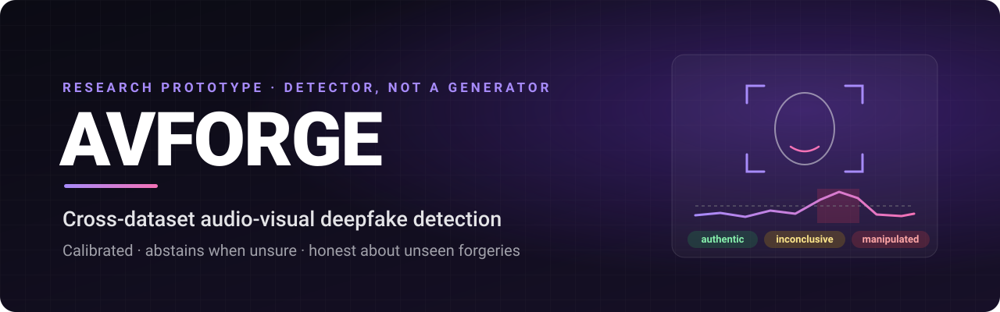

<p align="center">
  
</p>

<p align="center">
  <strong>Cross-dataset audio-visual deepfake detection that is honest about what it does not know.</strong>
</p>

<p align="center">
  <a href="https://github.com/samrender-tech/Deepfake-Detection-/actions/workflows/ci.yml"></a>
  
  
  
  
  <a href="LICENSE"></a>
</p>

<p align="center">
  <a href="#quick-start">Quick start</a> ·
  <a href="#features">Features</a> ·
  <a href="#command-line">CLI</a> ·
  <a href="#api">API</a> ·
  <a href="#training-on-real-data">Training</a> ·
  <a href="#limitations">Limitations</a>
</p>

<p align="center">
  Built by <strong>Samrender Singh Saini</strong> · <a href="https://github.com/samrender-tech">@samrender-tech</a>
</p>

---

## Why this project exists

Published deepfake detectors routinely report more than 95% accuracy on the
dataset they were trained on, and then fall to around 65% on forgery methods
they have never seen. That gap is the real problem, and most systems hide it.

AVFORGE does three things about it:

1. **Measures the gap honestly.** It trains on one dataset and tests on
   another. The decision threshold always comes from the training source's
   validation split, never from the test set, and the code has no way to do
   otherwise.
2. **Tries to close the gap** with signals that do not depend on one
   generator's fingerprint:
   - **Self-Blended Images**: training fakes are built from a single real
     frame, so the model learns blending boundaries without seeing a generator.
   - **Audio-visual sync**: face and voice are usually forged by separate
     tools, so lip-speech mismatch is a property of the forgery pipeline
     itself. The sync encoder is trained on real video only.
   - **Degradation augmentation**: forces the model to rely on evidence that
     survives a social-media re-encode.
3. **Behaves responsibly when it is unsure.** Probabilities are calibrated, an
   uncertainty band produces an **Inconclusive** verdict instead of a guess, and
   inputs unlike the training data are flagged. There are three verdicts —
   *likely authentic*, *likely manipulated*, *inconclusive* — and no way for a
   client to show a bare real/fake label.

> **A detector, not a generator.** This project creates no synthetic media.
> CI fails the build if any generative-media dependency appears.

---

## Features

**Detection**
- Visual, audio and lip-sync streams fused through a reliability gate
- Works on silent video too (the audio streams are masked off, not faked)
- Temperature-scaled calibration and a conformal "inconclusive" band
- Out-of-distribution flagging for unfamiliar inputs

**Evidence for every verdict**
- Per-frame score timeline with **flagged time segments**
- Grad-CAM++ heat maps showing where the model looked
- Per-stream scores, lip-sync curve and audio spectrum
- A plain-language explanation grounded only in the numbers above

**Tools**
- **Web dashboard**: drag and drop one clip or up to 10 at once, live
  progress, history you can reopen or delete
- **Downloadable reports**: a single self-contained HTML file (works offline,
  prints cleanly) or JSON
- **Re-encode stability check**: recompresses the clip as a messaging app would
  and checks whether the verdict holds
- **Batch CLI**: score a whole folder to CSV/JSONL, with an HTML summary page
- **REST API** with API keys, rate limiting, Prometheus metrics, drift
  monitoring and automatic deletion of uploads
- **Model export** to TorchScript, ONNX and INT8, each checked against the
  original model

---

## Quick start

Requires Python 3.10–3.12, `ffmpeg`, and Node 20+ for the dashboard.

```bash
git clone https://github.com/samrender-tech/Deepfake-Detection-.git
cd Deepfake-Detection-

make install-all   # virtualenv + all dependencies
make smoke         # whole pipeline on synthetic clips, no dataset needed
make web           # build the dashboard
make serve RUN=runs/smoke_test/seed0
```

Open <http://localhost:8000>. API docs are at `/docs`.

> The smoke model is trained on a few synthetic clips for two epochs. It proves
> the pipeline works end to end; its verdicts mean nothing. See
> [Training on real data](#training-on-real-data).

---

## Command line

```bash
# One clip, with a report and the stability check
ddetect predict clip.mp4 --run runs/<exp>/seed0 --report clip.html --stability

# A whole folder
ddetect batch clips/ -r --run runs/<exp>/seed0 --out verdicts.csv --report-dir reports/

# Dataset integrity / leakage check
ddetect audit --manifest data/manifests/ffpp.parquet

ddetect --help     # train, eval, manifest, preprocess, matrix, aggregate, ...
```

`batch` records a failed clip as an error row instead of stopping, and exits
non-zero if any clip failed.

## API

| Method | Endpoint | Purpose |
|---|---|---|
| `POST` | `/v1/analyses` | upload a video; returns a job id |
| `GET` | `/v1/analyses/{id}` | status and result |
| `GET` | `/v1/analyses/{id}/events` | live progress (server-sent events) |
| `GET` | `/v1/analyses/{id}/report?format=html\|json` | downloadable report |
| `DELETE` | `/v1/analyses/{id}` | delete the result and its images now |
| `GET` | `/v1/analyses` | recent analyses |
| `GET` | `/v1/model` | loaded model, threshold, calibration |
| `GET` | `/v1/limits` | upload limits and the disclaimer |
| `GET` | `/v1/drift` | is live traffic still in-distribution? |
| `GET` | `/healthz`, `/readyz`, `/metrics` | operations |

Set `API_KEYS` to require an `X-API-Key` header. Every optional backend
(Postgres, Redis, S3/MinIO, OpenTelemetry, MLflow) falls back to an in-process
default when unset, so `make serve` needs nothing else. See
[docs/DEPLOYMENT.md](docs/DEPLOYMENT.md) for the Docker Compose stack.

---

## Training on real data

| Protocol | Train on | Test across | Why |
|---|---|---|---|
| **V** — visual | FaceForensics++ c23 | Celeb-DF, DFDC, DeeperForensics | visual generalisation |
| **AV** — audio-visual | DFDC (has audio) | FakeAVCeleb, LAV-DF | lip-sync and voice |
| **Full system** | FF++ + DFDC | all of the above | everything |

FaceForensics++ and Celeb-DF have no usable audio, so the audio-visual
experiments use DFDC, FakeAVCeleb and LAV-DF. One checkpoint serves both
protocols because the fusion head knows when audio is missing.

```bash
make datasets    # what each dataset is and how to get it
make get-dfdc    # DFDC from Kaggle: instant, has audio
make preflight   # disk, GPU, dependencies, cache readiness

python -m ddetect.data.build_manifest --dataset dfdc --root ~/data/dfdc --audit
python -m ddetect.data.run_preprocess --manifest data/manifests/dfdc.parquet --workers 8
python -m ddetect.train --exp baseline_a --model baseline --epochs 12
python -m ddetect.evaluate --run runs/baseline_a/seed0 --bootstrap 2000
make eval-final RUN=runs/baseline_a/seed0   # the one sanctioned test-set run
```

FaceForensics++, Celeb-DF and FakeAVCeleb require access request forms, which
take days. A CUDA GPU is needed for real numbers; there is a Colab notebook in
[`notebooks/`](notebooks/colab_train.ipynb). See
[docs/DATASET_CARD.md](docs/DATASET_CARD.md) for access and licences.

---

## Project layout

```
ddetect/        core package
  contracts.py    frozen interfaces between data, models, metrics and serving
  data/           manifests, preprocessing cache, augmentation, SBI, leakage guard
  models/         visual, audio, sync and fusion streams
  train.py        training          evaluate.py   metrics
  calibrate.py    calibration + abstention     ood.py  unfamiliar-input flagging
  inference.py    Detector: the single inference entry point
  report.py       flagged segments + HTML reports
  stability.py    re-encode stability check
api/            FastAPI app, job queue, storage, security, drift, metrics
web/            React + Tailwind dashboard (Playwright end-to-end tests)
agents/         research agents with a test-set firewall
experiments/    experiment grid, results aggregation, figures
paper/          IEEE paper source
docs/           model card, dataset card, threat model, architecture, deployment
tests/          unit, integration and safety-gate tests
```

## Quality gates

These run in CI on every push and block a merge:

| Gate | Protects against |
|---|---|
| `tests/test_leakage.py` | identities or duplicate videos crossing splits, which fakes a better result |
| `tests/test_detector_parity.py` | the demo and the reported numbers drifting apart; concurrency bugs in serving |
| `tests/test_agents.py` + agent evals | an agent reading the test set, or an ungrounded explanation |
| `tests/test_security.py` | malicious uploads reaching ffmpeg/OpenCV |
| `scripts/scope_audit.py` | any generative-media dependency |
| Playwright e2e | the UI ever showing a bare real/fake label or dropping the disclaimer |

```bash
make test          # full suite
make lint typecheck scope
make e2e           # browser tests against the real stack
```

---

## Limitations

This is a research prototype. Its accuracy drops substantially on manipulation
methods it has not seen. **It is not evidence**, and must not be used for
legal, forensic, journalistic, employment or immigration decisions. Read
[docs/MODEL_CARD.md](docs/MODEL_CARD.md) before relying on any output.

## License

[MIT](LICENSE) © Samrender Singh Saini. Datasets and pretrained weights carry
their own licences.
